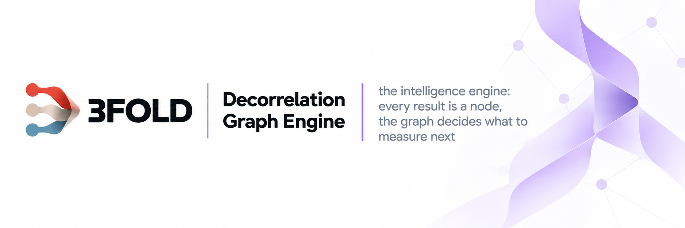
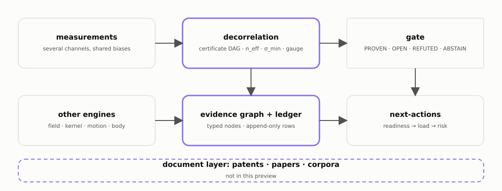

<picture>
  <source media="(prefers-color-scheme: dark)" srcset="docs/brand/banner-dark.png">
  
</picture>

> Part of 3FOLD · every other engine writes its results into this graph

---

## What it is

Every project in this ecosystem uses this engine. It reads documents — patents, papers, datasets — and turns what they
claim into a graph that an agent reads before deciding what to do next. Nothing in the graph is a finished answer: a
goal is a node, and a node that resists gets opened into the smaller things it stands on.

An engineering platform has more goals than it can measure at once. This repository decides which measurement to make next. Every goal, measurement and open question is a node in one graph, and the search opens the node that unlocks the most for the least cost.

## Architecture

<picture>
  <source media="(prefers-color-scheme: dark)" srcset="docs/fig/architecture-dark.svg">
  
</picture>

---

## The unlock graph

A goal is a node. The engine opens it into the sub-nodes it depends on, and marks which of those are load-bearing: the ones the goal cannot be reached without. Work goes to one load-bearing node at a time, the hardest first. A hard node is itself opened the same way. When every sub-node is complete, the goal is unlocked.

**No dead ends.** A measurement that fails does not close its node. The entry that records it also records which requirement is now the limit, and adds the ways to meet that requirement as new nodes.

**Next best action.** Every open node is scored by value per cost: how many goals it unlocks, weighted by what each goal is worth, divided by what it costs to work on. A node whose dependencies are not built yet is shown as blocked. The highest score is the node the search opens next. The sequence is not planned in advance; every result changes the graph, the ranking is computed again, and the sequence is what that repeated choice produces.

---

## Densification

*Densify the graph* is the standing instruction. It means adding connections on purpose, three ways.

**Throws.** Parts of the framework are numbered — a cell, an algorithm, a dataset — and you force a connection between
three or four drawn at random to see whether a thread exists. Chains and triple-throws repeat it.

**Boundary.** Take the edge between a worked-out area and one that is not, and densify there.

**Conf — the stress point.** Two results that contradict each other are the most valuable thing in the graph, so you go
looking for them; where two disagree the search stops and opens the node into its parts instead of picking a winner.
Two checks on the optical constants of gold, silica and water, one predicting n from k through the Kramers–Kronig integral and the other predicting k from n through a fitted oscillator model, were tested for independence. Pooled over the three materials with an unsigned correlation they came out as one check, 1.13 of a possible 2. Per material, with the sign kept, the correlation runs from −0.87 to +0.92, and the pooled reading was withdrawn: the sign carries the information, and pooling had hidden it. The example, its data and the review that overturned it are in the repository.

That arithmetic also runs forward. With K channels and worst pairwise error correlation ρ, effective independence is
K / (1 + (K−1)·ρ⁺); identical channels fall toward 1, **opposing channels count as two**. The instruction is therefore
to acquire the opposite data point, not more of the same.

**Vibrate.** To find the least-covered direction, the coverage matrix is perturbed along dithered directions and the
direction whose smallest singular value responds most is read off; candidates are ranked by how much each would raise
it. On a planted uncovered direction the probe peaks there, the top candidate scores Δσ_min = 1.0, and σ_min goes
0.0 → 1.0 once that measurement is taken.

The second half of the method is deliberate connection-making. The parts of the platform are numbered — physics primitives and methods through patent mechanisms to reference datasets — and combinations are drawn and forced: a four-step causal chain, a three-way conflict that has to be resolved by a synthesis, a mechanism from one domain crossed with a target in another. Most forced links are noise and a skeptical pass kills them; the yield is the rare real edge. The refinement that makes it work: the productive pairs are **semantically far and mechanically close** — battery thermal runaway, buckling and a micro-electromechanical pull-in are different fields with the same saddle-node fold underneath. In the literature this is analogical transfer by structural rather than surface similarity.

Not reproducible from this repository: one forced chain came through the whole path and produced a number. It connects a computed-tomography defect population to a fatigue limit, using a zero-parameter relation between defect size and endurance rather than a fitted stress-life curve. Carried onto a published titanium powder-bed dataset in another worktree, it read 33 builds, took the worst measured defect at √area = 872.1 µm and returned a fatigue limit of **239.7 MPa**, with a conservative bracket at 209.6 MPa and a population median of 328.5 MPa. It also reproduced the compression the relation predicts: because the limit goes as the sixth root of defect area, a spread in defect size arrives as a **0.167** times smaller spread in the limit — the measured ratio matched the law to three digits, and dropping the single worst build moves the answer by 2.9 %.

---

## What feeds it

**Documents and data, routed by value.** A source is scored by demand (what the graph currently lacks) × fill × novelty ÷ cost. What arrives passes an admission gate — at least two decorrelated channels must agree, or the item is held as ABSTAIN — and is split into channels, each with its own certificate, each with its own certificate, before it enters the corpus. Coverage is derived from the corpus manifests and feeds back into the demand score, so the loop is closed.

**Constraint nets.** (Measured in the platform, not shipped here.) A goal's variables are coupled as edges in a net. Every data point tightens edges; the search runs in the coupled net, not over free parameters. The vehicle net has 34 edges, 30 tight and 4 open, each open edge naming what would close it (a body-in-white fatigue cut-off, a cast-aluminium bolt-boss limit, a mass-asymmetry risk, an electronics floor). The projector net is 15 of 15 tight.

**Patents, two ways in.** A patent is read as a claim the physics either reproduces or fails to reproduce. If it
reproduces, its numbers become anchors; if not, the gap points at physics to fix. The same adjoint machinery run
backward recovers the parameters a patent withheld.

**Anchors.** External reference data is a node type of its own, including anchors that do not exist yet: a node whose
content is the missing dataset it names, so the frontier can route to acquiring it.

**Big goals as coverage probes.** An over-ambitious goal is fed in to expose where the graph has no coverage. A goal
no node depends on is flagged, because no frontier work can reach it.

The corpus behind the graph is deliberately mixed, because the whole method turns on channels that fail differently:

- **Video and datasets.** Each of the five channels is profiled separately, so that coverage is counted per channel rather than per file. 
- **Papers as a graph.** The shipped example is 50 arXiv papers, 78 edges (60 similarity, 14 both, 4 citation), largest component 42, average clustering 0.36 (examples/paper_graph). Hole-finding on a graph of this shape is link prediction and structural-hole detection, and it is what the paper graph is for.

---

## Where it is used

Every project in this ecosystem was built by agents working from this graph, and we do not know how much of the heavy lifting is done by the graph and how much by the models themselves, or what contributes in what degree. We have not run an A/B test.

Six of the goals worked on from the graph, and what has been created for each:

- **A digital twin of the Earth**, with manufacturing traced down to raw materials. Opened into a manufacturing tree and a national system. Measured so far: Norway's offshore decommissioning queue, quantified from the open well registry, and a baseline for the Nordic power system from open grid data. 28 evidence files.
- **A benchtop lithography machine**, aimed past the industry on yield and flexibility, with every process built from scratch rather than copied. What exists is not a machine but measured floors and walls on single process steps: a resolution floor for one patterning route, cross-checked to 1.5 %, and an anti-reflection wall located in a gap of refractive index, partly filled since. 75 evidence files.
- **A glass factory chain**, from Swedish quartz sand to a finished lens, with the grinding and polishing machines designed alongside the glass. Five steps of the chain are quantified, from the melt to a first lens judged by ray tracing, and that judgement set the next optics step. 32 evidence files.
- **A vehicle** built to outlast the most robust cars in use and to be maintained by its owner without special tools. What exists is the constraint net, 34 coupled variables with 30 tight and 4 open, and one structural trade run through finite elements, a rib against a thicker wall, with its mass and stress margins.
- **Micro-factories, and machines that build machines.** A factory small enough to sit beside its product, built by machines that can make the parts of the next machine. Existing factories were measured first, a micro-factory concept was drawn that beats them on floor area per unit, and the first machine has a complete manufacturing process. Open: which machines must exist before machines can build machines.
- **A prospecting prediction engine**, simulating where minerals with sought properties can be found rather than correlating maps of past finds. One vertical slice runs, on quartz purity: a calibrated prior, sealed prediction bands, and a sampling plan ranked by value of information. The depth-data corpus for validation is inventoried, 2 038 open well pairs from the Norwegian shelf. No held-out prediction has been made yet. 62 evidence files.

All six are open. What exists for each was produced this way: the nodes the goal stands on, the measurements taken so far, and the next node to open. Those nodes and evidence files were created in the private platform and are not part of this repository; what ships here is the engine that produced them.
